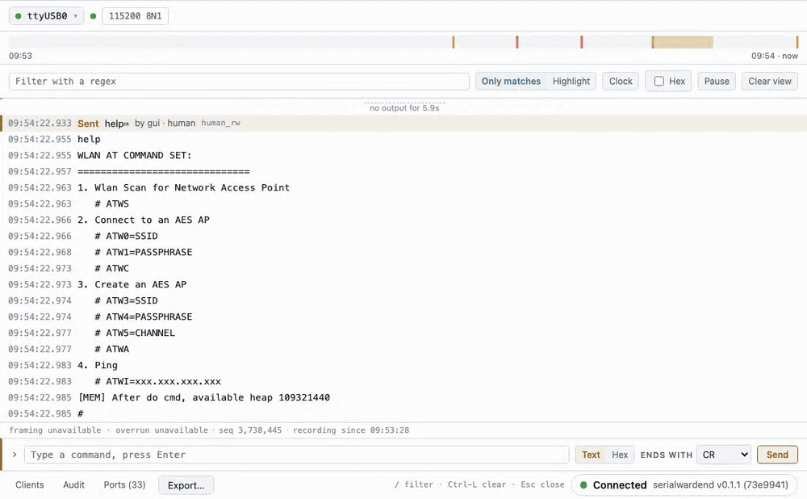

# SerialWarden

[](https://github.com/SheldonChangL/serialwarden/actions/workflows/ci.yml)
[](https://github.com/SheldonChangL/serialwarden/releases)
[](LICENSE)

[English](README.md) | 繁體中文

**給韌體開發用的 serial port broker。** 由一個 daemon 獨占 serial port，並記錄所有收發與事件。你的 terminal、瀏覽器、燒錄工具和 AI agent 都以 client 身分接上它，無論在本機或從另一台電腦連入。

```text
                                    ┌── CLI（tail / write / export）
                                    ├── Web UI，本機或透過 ssh -L
UART / USB serial ── serialwarden ──┼── AI agent（MCP），本機或透過 ssh
                       daemon       ├── 你自己的 script
                     (records       └── 燒錄工具 ◀── 暫時借出 port（lease）
                      always)
```



<sub>真機錄製：CH340 轉接的 Realtek Ameba 開發板接在 Ubuntu 22.04 上，瀏覽器透過 SSH tunnel 連線。lease 那段用的是佔用 port 4 秒、不寫入任何資料的替身腳本，並非真的燒錄。</sub>

## 解決哪些痛點

- **「開著 serial monitor 就不能燒錄，關掉燒完再打開，開機 log 早就跑完了。」**
  daemon 一直持有 port，板子一接上就開始錄。用 `serialwarden run -- esptool.py ...` 燒錄時，port 會暫時借給燒錄工具，工具結束後自動收回。燒錄前後的 log 接在同一份紀錄裡，中間的空檔也會明確標出來。
- **「板子接在實驗室那台電腦，我人在自己的筆電前。」**
  用 `ssh -L` 轉一個 port，就能在瀏覽器打開完整的 web UI：即時 log、可以直接打指令的輸入列、timeline 和匯出。輸入列有歷史紀錄、可切換 CR/LF/CRLF 和 hex 模式，還能用 Tab 補完裝置印過的路徑。
- **「我想讓 AI agent 跟我看同一個 console。」**
  agent 透過 MCP 連上，可以在本機，也可以用 `ssh lab-host serialwarden mcp` 從遠端連，讀到的就是你在瀏覽器裡看的同一份 log。agent 送出的指令會顯示在你的 log 上，並標明是它送的；每個寫入預設都要等你在 web UI 按「Allow once」才會送出，可以用白名單放行。`erase`、`efuse`、進 bootloader 這類高風險指令，就算在白名單裡也一定要等你核准。agent 的讀取每次都有大小上限，因此不會卡住，也不會塞爆 context。
- **「板子昨晚自己重開，當時印了什麼？」**
  錄製不需要有人開著 terminal。任何一段時間都能匯出成純文字、JSONL 或原始 bytes。
- **「今天又變成哪一個 ttyUSB？」**
  轉接晶片有提供 USB 序號時，裝置以序號辨識，重新插拔後設定會跟著板子走。許多 CH340 沒有序號，這時會改用 port 路徑辨識。

支援 macOS 與 Linux，單一執行檔，web UI 內建在裡面。

## 安裝

```sh
curl -fsSL https://raw.githubusercontent.com/SheldonChangL/serialwarden/main/install.sh | sh
```

這個指令會從[最新 release](https://github.com/SheldonChangL/serialwarden/releases) 下載符合你機器的預編譯執行檔，支援 macOS arm64/x86_64 與 Linux x86_64/aarch64。下載後會驗證 SHA-256，再裝到 `~/.local/bin`。如果沒有適用你平台的預編譯檔，會改成從原始碼編譯，這需要 Rust 和 Node 22 以上。另外也有 `.deb` 可用。Linux 上你的帳號需加入 `dialout` 群組；macOS 上有些轉接線要另外裝晶片廠驅動。詳見 [docs/setup.md](docs/setup.md)（英文）。

## 快速上手

```sh
serialwarden service install      # 立即啟動 daemon，之後每次登入自動啟動（或用 serialwarden daemon 在前景執行）
serialwarden devices              # 列出接上的裝置
serialwarden tail -f              # 在 terminal 即時追蹤 log
open http://127.0.0.1:5590        # 或打開 web UI（Linux 用 xdg-open）
```

不用關任何東西就能燒錄：

```sh
serialwarden run -- esptool.py --port "$SERIALWARDEN_LEASE_PATH" write_flash 0x0 firmware.bin
```

板子接在另一台電腦（`lab-host`，上面要有 SerialWarden daemon 在執行，並設好 SSH 金鑰登入）：

```sh
ssh -N -L 15590:localhost:5590 lab-host              # 然後開 http://127.0.0.1:15590
claude mcp add lab-board -- ssh lab-host '~/.local/bin/serialwarden' mcp   # 讓 agent 也能讀
```

agent 跟板子在同一台電腦：`claude mcp add serialwarden -- serialwarden mcp`。任何能啟動 stdio server 的 MCP host 都適用。

更多內容在 [docs/usage.md](docs/usage.md)（英文），包含遠端板子、燒錄、MCP 工具。

## 為什麼不用 screen / minicom，或一般的 serial MCP server？

這些工具的設計都是「一個程式打開 port、獨占它」。只要第二個程式也需要這個 port，就會互相卡住。

| | screen / minicom / picocom | 一般的 serial MCP server | SerialWarden |
|---|---|---|---|
| 沒人在看時也持續錄製 | 否 | 通常不是這種設計 | 是，裝置一接上就開始 |
| 監看中直接燒錄 | 要先關掉 | 依實作而定 | 用 lease 借出，空檔明確記錄 |
| 多個 client 同時用（你、同事、agent） | 否 | 依實作而定，常只支援一個 | 是 |
| 從另一台電腦使用 | 透過 SSH 開 terminal | 依實作而定 | web UI 走 `ssh -L`，MCP 走 `ssh` |
| agent 送出高風險指令前需要人工核准 | 不適用 | 通常沒有提到 | 是 |

相關工具：[ser2net](https://github.com/cminyard/ser2net)、[conserver](https://www.conserver.com/)（設計最接近的傳統工具）、`tio --socket`。

## 目前狀態

還在早期階段（v0.x），client 協定與儲存格式都可能再調整。目前每天在 Ubuntu 22.04 上用它監看並燒錄一塊 RTL8735B 板子。實機已經抓到 mock device 測試沒涵蓋的問題，例如 Realtek RTL8735B 在同一條輸出裡混用 CR 與 LF 斷行，現在測試會同時產生這兩種斷行。以下還沒在實機上驗證：74880 這類非標準 baud、在 Arduino Uno 上開 port 不觸發 DTR 重置、用 `esptool` 完整燒錄一次。清單見 [docs/manual-checklist.md](docs/manual-checklist.md)。

限制：

- 只支援 macOS 與 Linux。
- web UI 沒有登入機制。它只監聽 localhost，並會拒絕跨站請求，遠端存取一律走 SSH。
- 時間戳記是資料抵達主機的時間，USB 轉接晶片的緩衝會影響它的精確度（見 [docs/timestamps.md](docs/timestamps.md)，英文）。

從舊名稱 `serialwrap` 升級？見 [docs/setup.md](docs/setup.md#upgrading-from-serialwrap)。已錄的資料會自動搬過去。

## 文件

以下文件目前只有英文版。

- [docs/usage.md](docs/usage.md)：遠端板子、燒錄、AI agent
- [docs/setup.md](docs/setup.md)：安裝方式、Linux 權限、macOS 驅動、背景服務、升級、從原始碼編譯
- [docs/security.md](docs/security.md)：寫入把關、核准流程，以及為什麼裝置輸出只當資料、不當指令
- [Wiki](https://github.com/SheldonChangL/serialwarden/wiki)：架構、事件流格式、client 協定
- [CONTRIBUTING.md](CONTRIBUTING.md)：編譯、測試、回報實機問題

MIT 授權。SerialWarden 免費，以後也會維持免費。如果它幫你省了時間，可以到 [Ko-fi](https://ko-fi.com/sheldonchang) 支持；有沒有支持，軟體都不會有任何差別。一份來自實機的 bug 回報更有價值。
